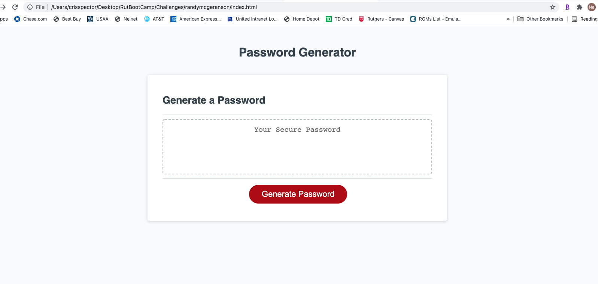

# Password-Generator

### Summary
* HTML and CSS and Javascript documents create a random password generator.
* This project emphasizes the use of using Javascript to make dynamic changes to an HMTL document

### To Execute File:
Open in browser

### Features: 
HTML, Javascript, CSS

## Authors

**Cris Spector**

